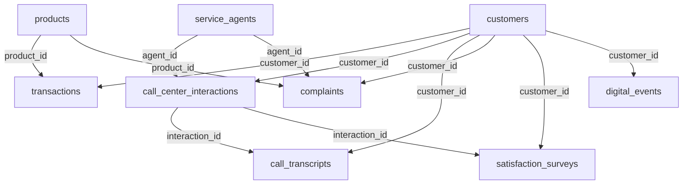

# Join Graph

```mermaid
graph TD
  customers -->|customer_id| transactions
  products -->|product_id| transactions
  customers -->|customer_id| call_center_interactions
  service_agents -->|agent_id| call_center_interactions
  call_center_interactions -->|interaction_id| call_transcripts
  customers -->|customer_id| call_transcripts
  customers -->|customer_id| complaints
  service_agents -->|agent_id| complaints
  products -->|product_id| complaints
  call_center_interactions -->|interaction_id| satisfaction_surveys
  customers -->|customer_id| satisfaction_surveys
  customers -->|customer_id| digital_events
```

See `join_quality.csv` for exact rates and status.
